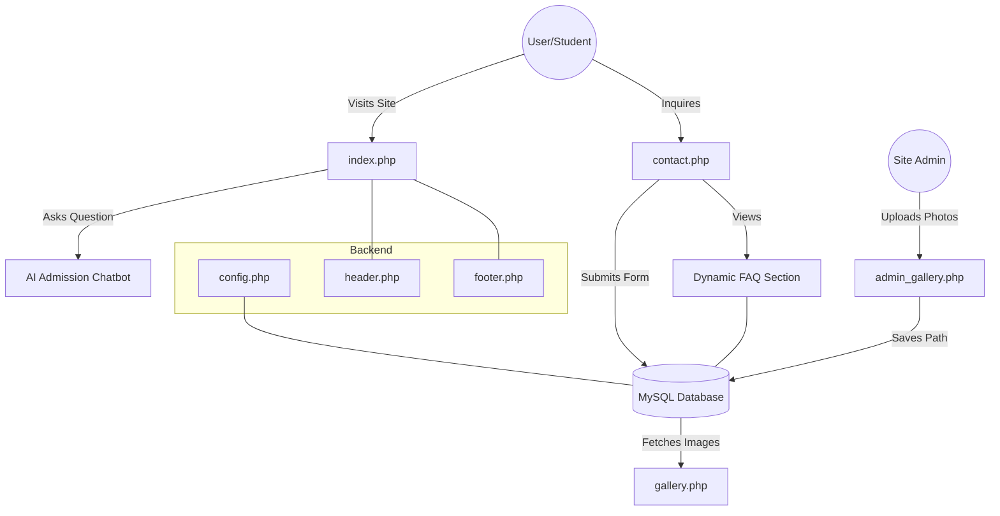

# 🏫 West Prime Horizon - School Website 
> ### ⚠️ **UNDER PRODUCTION**
> This project is currently in the active development phase. Features and database schemas are subject to change.

## 🚀 Overview
West Prime Horizon is a modern, premium school website designed to provide a seamless experience for prospective students, parents, and alumni. It features a robust PHP/MySQL backend, an AI-powered admission chatbot, and a dynamic gallery management system.

## 🛠️ Tech Stack
- **Frontend**: HTML5, Vanilla CSS3 (Custom Design System), JavaScript (ES6+).
- **UI Framework**: Bootstrap 5 (for grid, navigation, and carousel).
- **Backend**: PHP 8.x.
- **Database**: MySQL.
- **Fonts**: Google Fonts (Outfit).

## 🔄 The PHP Refactor
The project was originally built using static HTML files. We have refactored the entire project to PHP to support dynamic content and modularity:
- **`index.html` → `index.php`**: Integrated admission chatbot and testimonial carousel.
- **`about.html` → `about.php`**: Modularized with common header/footer.
- **`academics.html` → `academics.php`**: Categorized course listings.
- **`contact.html` → `contact.php`**: Integrated database-driven FAQs and contact form handling.
- **`gallery.html` → `gallery.php`**: Now fetches images dynamically from the `gallery` table.
- **New Components**: Created `includes/header.php` and `includes/footer.php` for site-wide consistency.

## 📊 System Flow Diagram

## ⚙️ How It Works
1. **Dynamic Content**: Data like FAQs and Gallery images are stored in MySQL. When a page loads, PHP queries the database to display the latest information.
2. **Contact System**: When a user submits the contact form, PHP sanitizes the input and stores it in the `contacts` table for administrative review.
3. **Gallery Management**: The `admin_gallery.php` interface allows unauthorized (simplified) uploading of school event photos. The PHP script handles the file moving and database record creation.
4. **Admission Assistant**: A frontend JavaScript-based chatbot logic is tailored to respond specifically to school admission requirements, tracks, and enrollment schedules.

---
*Developed for Excellence by West Prime Horizon Inc.*
